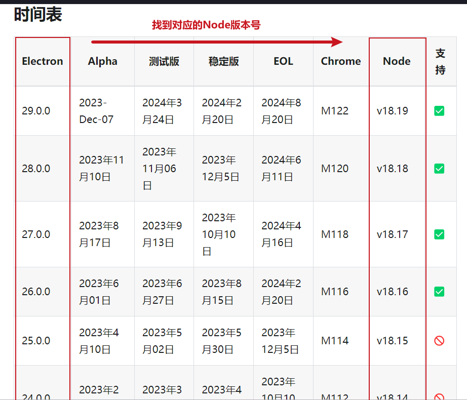

# 前端对接电子秤、扫码枪设备serialPort 串口使用教程

**因为最近工作项目中用到了电子秤，需要对接电子秤设备。以前也没有对接过这种设备，当时也是一脸懵逼，脑袋空空。后来就去网上搜了一下前端怎么对接，然后就发现了**[SerialPort](https://serialport.io/)串口。

> **Serialport**
>
> **官网地址：**[https://serialport.io/](https://serialport.io/)
>
> **Github：**[https://github.com/serialport/node-serialport](https://github.com/serialport/node-serialport)
>
> **官方描述：使用 JavaScript 访问串行端口。Linux、OSX 和 Windows。**

## SerialPort是什么？

> **SerialPort 是一个用于在 Node.js 环境中进行串口通信的库。它允许开发者通过 JavaScript 或 TypeScript 代码与计算机上的串口设备进行交互。SerialPort 库提供了丰富的 API，使得在串口通信中能够方便地进行设置、监听和发送数据。**

**一般我们的设备(电子秤/扫码枪)会有一根线插入到电脑的USB口或者其他口，电脑上的这些插口就是叫****串口**。设备上的数据会通过这根线传输到电脑里面，比如电子秤传到电脑里的就是重量数值。那么我们前端怎么接收解析到这些数据的呢？**SerialPort**的作用就是用来帮我们接收设备传输过来的数据，也可以向设备发送数据。

**简单概括一下：** **SerialPort就是我们前端和设备之间的翻译官，可以接收设备传输过来的数据，也可以向设备发送数据。**

## SerialPort怎么用？

**SerialPort可以在Node项目中使用，也可以在Electron项目中使用，我们一般都是用在Electron项目中，接下来讲一下在Electron项目中SerialPort怎么下载和引入**

### 1、创建Electron项目

```
mkdir my-electron-app && cd my-electron-app
npm init -y
npm i --save-dev electron
```

*网上有很多Electron教程，这里不再详细说了*

**在package.json中看一下自己的Electron的版本，下一步会用到**。

### 2、下载SerialPort

**这里先看一下自己使用的Electron对应的Node版本是什么，打开下面electron官网看表格中的Node那一列**

**Electron发行时间表：**[https://www.electronjs.org/zh/docs/latest/tutorial/electron-timelines](https://www.electronjs.org/zh/docs/latest/tutorial/electron-timelines)



**如果你Electron对应的Node版本高于v12.0.0，直接下载就行**

```
npm install serialport
```

**如果你Electron对应的Node版本低于或等于v12.0.0，请用对应的Node版本对应下面的serialport版本下载**

> [https://serialport.io/docs/next/guide-platform-support#last-known-versions-for-unsupported-versions-of-nodejs](https://serialport.io/docs/next/guide-platform-support#last-known-versions-for-unsupported-versions-of-nodejs)

* **对于 Node.js 版本** `0.10`和 `0.12`，最后一个正常运行的版本是 `serialport@4`。
* **对于 Node.js 版本** `4.0`，最后一个正常运行的版本是 `serialport@6`.
* **对于 Node.js 版本** `8.0`，最后一个正常运行的版本是 `serialport@8`.
* **对于 Node.js 版本** `10.0`，最后一个正常运行的版本是 `serialport@9`.
* **对于 Node.js 版本** `12.0`，最后一个正常运行的版本是 `serialport@10`.

> **我项目的Electron版本是11.5.0，对应的Node版本号是12.0，对应的serialport版本号是serialport@10.0.0**

### 3、编译Serialport

* **安装node-gyp 用于调用其他语言编写的程序（如果已安装过请忽略这一步）**
  ```
  npm install -g node-gyp
  ```
* **进入@serialport目录**
  ```
  cd ./node_modules/@serialport/bindings
  ```
* **进行编译，target后面换成当前Electron的版本号**
  ```
  node-gyp rebuild --target=11.5.0
  ```

**如果编译的时候报错了就将自己电脑的Node版本切换成当前Electron对应的版本号再编译一次**

**查看Electron对应Node版本号：**[https://www.electronjs.org/zh/docs/latest/tutorial/electron-timelines](https://www.electronjs.org/zh/docs/latest/tutorial/electron-timelines)

**编译成功以后就可以在代码里使用Serialport了**

### 4、使用Serialport

> **serialport官网使用教程：**[https://serialport.io/docs/next/guide-usage](https://serialport.io/docs/next/guide-usage)

#### 4.1、引入Serialport

```
const { SerialPort } = require('serialport')
// or
import { SerialPort } from 'serialport'
```

#### 4.2、创建串口（重点！）

**创建串口有两种写法，新版本是这样写法** `new SerialPort(params, callback)`

```
const port = new SerialPort({
  path: 'COM1',  // 串口号
  baudRate: 9600, // 波特率
  autoOpen: true,  // 是否自动打开端口
}, function (err) {
  if (err) {
    return console.log('打开失败: ', err.message)
  }
  console.log('打开成功')
})
```

**旧版本是下面这样的写法** `new Serialport(path, params, callback)`，我用的是serialport@10.0.0版本就是这样的写法

```
const port = new Serialport('COM1', {
  baudRate: 9600,
  autoOpen: true,  // 是否自动打开端口
}, function (err) {
  if (err) {
    return console.log('打开失败: ', err.message)
  }
  console.log('打开成功')
})
```

**创建串口的时候需要传入两个重要的参数是path和baudRate，****path是串口号，baudRate是波特率**。最后一个参数是回调函数

#### 4.3、手动打开串口

**如果autoOpen参数是false，需要使用** `port.open()`方法手动打开

```
const port = new SerialPort({
  path: 'COM1',  // 串口号
  baudRate: 9600, // 波特率
  autoOpen: false,  // 是否自动打开端口, 默认true
})
// autoOpen参数是false，需要使用port.open()方法手动打开
port.open(function (err) {
  if (err) {
    return console.log('打开失败', err.message)
  }
  console.log('打开成功')
})
```

#### 4.4、接收数据（重点！）

**接收到的data是一个Buffer，需要转换为字符串进行查看**

```
port.on('data', function (data) {
  // 接收到的data是一个Buffer，需要转换为字符串进行查看
  console.log('Data:', data.toString('utf-8'))
})
```

**接收过来的data就是设备传输过来的数据，转换后的字符串就是我们需要的数据，字符串里面可能有多个数据，我们把自己需要的数据截取出来就可以了**

**假设通过电子秤设备获取到的数据就是"205    000    000"，中间是四个空格分割的，第一个数字205就是获取的重量，需要把这个重量截取出来。下面是我的示例代码**

```
port.on('data', function (data) {
  try {
      // 获取的data是一个Buffer
      // 1.将 Buffer 转换为字符串 dataString.toString('utf-8')
      let weight = data.toString('utf-8')
      // 2.将字符串分割转换成数组，取数组的第一个值.split('    ')[0]
      weight = weight.split('    ')[0]
      // 3.将取的值 去掉前后空格
      weight = weight.trim()
      // 4.最后转换成数字,获取到的数字就是重量
      weight = Number(weight)
      console.log('获取到重量：'+ weight);
  } catch (err) {
    console.error(`
      重量获取报错：${err}
      获取到的Buffer: ${data}
      Buffer转换后的值：${data.toString('utf-8')}
    `);
  }
})
```

#### 4.5、写入数据

```
port.write('Hi Mom!')
port.write(Buffer.from('Hi Mom!'))
```

#### 4.6、实时获取(监听)所有串口

```
const { SerialPort } = require('serialport')

SerialPort.list().then((ports, err) => {
    // 串口列表
    console.log('获取所有串口列表', ports);
})
```

#### 更多内容

**serialport官网教程：**[https://serialport.io/docs/next/guide-usage](https://serialport.io/docs/next/guide-usage)
